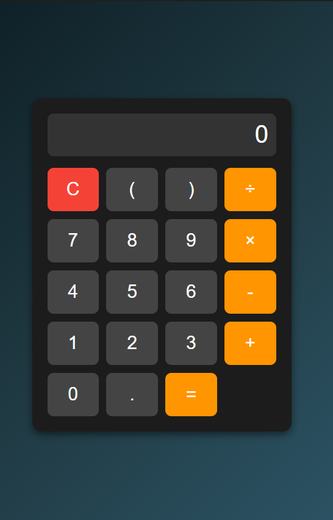

# Cool Calculator

A sleek, modern calculator built with HTML, CSS, and JavaScript. This calculator features a dark theme and intuitive design, making it a perfect addition to any personal project or website.

## Features

- Basic arithmetic operations: addition, subtraction, multiplication, and division.
- Clear button to reset the display.
- Stylish design with a dark theme and hover effects.
- Responsive layout that works well on different devices.

## Preview

## Getting Started

Follow these steps to use or modify the calculator:

### Prerequisites

- A web browser (e.g., Chrome, Firefox, Edge).

### Installation

1. Clone or download the repository.
2. Open the `index.html` file in your browser.

### Usage

1. Use the numeric and operator buttons to perform calculations.
2. Press the "C" button to clear the display.
3. Press the "=" button to calculate the result.

## Code Structure

- **HTML**: Defines the structure and elements of the calculator.
- **CSS**: Styles the calculator with a dark theme and hover effects.
- **JavaScript**: Adds interactivity and handles the calculator's logic.

## Customization

Feel free to modify the code to suit your needs:

- Update colors and fonts in the CSS file.
- Extend the functionality with more advanced operations (e.g., square root, power).
- Optimize the JavaScript for additional features.

## License

This project is open-source and available under the [MIT License](LICENSE).

---

Enjoy using the Cool Calculator! Contributions are welcome.

